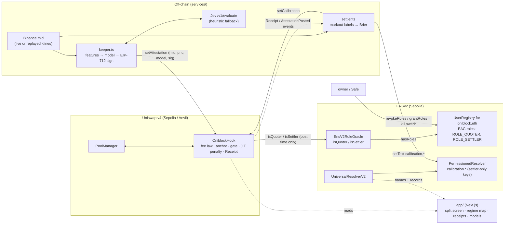

# Oniblock

**A Uniswap v4 hook that charges arbitrage flow a directional fee on the live gap between the pool price and the CEX mid. An attested model sets the fee's sensitivity `k` once per block. The model's public calibration record, written to ENSv2 by a role-scoped settler, decides how much power it gets.**

Built at ETHGlobal Tokyo 2026 for the Uniswap Foundation "Best Uniswap Stack Contribution (Start Fresh)" and ENS "Best Use of ENSv2" prizes. Liquidity stays permissionless: this is a standard v4 pool that anyone can LP into, not a prop AMM.

> Status: everything runs on local Anvil and on an Anvil fork of Sepolia, using the real ENSv2 contracts and the real v4 PoolManager. **Nothing has been broadcast to Sepolia yet.** The Sepolia steps below need a funded `DEPLOYER` key.

---

## The problem

- **Sandwiches are mostly handled already.** Private routing took most user-side sandwich extraction on Ethereum. It fell from about $10M/month in late 2024 to about $2.5M/month by October 2025, with an average profit of about $3 per attack (EigenPhi, December 2025). That is not what hurts LPs.
- **The LP problem is the stale mid.** A pool's price only moves when someone trades, and the CEX mid moves first. The next informed trader buys the stale pool price and sells elsewhere, so LPs sell cheap. This is LVR, or adverse selection. More than a quarter of the volume on the top-5 Ethereum DEXes is non-atomic arbitrage (Heimbach et al., IEEE S&P 2024).
- **Flat fees tax everyone to catch a few.** Raising the fee for everyone punishes the retail flow LPs earn on. It also rewards same-block JIT liquidity, because the JIT position is the one collecting the fee.

## How it works

```
gap    = |oracleMid − poolMid| / oracleMid              (pips, measured live before every swap)
toward = the swap direction that moves the pool toward the oracle
fee    = toward ? min(baseFee + k · highWaterGap[dir], feeMax) : baseFee
stale mid (older than staleBlocks) → conservativeFee in both directions. The hook never reverts.
```

1. **Directional fee law, in the contract.** Only swaps that move the pool *toward* the oracle mid (the arbitrage direction) pay `k · gap`. Swaps in the other direction pay `baseFee`. The law is public and readable on-chain through `quoteFee`. The hook returns `fee | OVERRIDE_FEE_FLAG` on a dynamic-fee pool.
2. **Per-block anchor with a high-water gap.** The first touch in a block anchors one attestation's `(k, model, mid)`. Each direction keeps the largest toward-oracle gap seen in that block. A split arb (many sub-swaps in one transaction) therefore pays the full fee on every part. Once the live price is back at or past the mid, the direction pays base again, so retail that trades after an arb is not overcharged.
3. **Stale fallback, never revert.** If no fresh attestation exists, both directions pay `conservativeFee` (not `feeMax`). Every data check happens in the keeper's `setAttestation` transaction, never in the swap path, so the hook never breaks V4Quoter or aggregator quotes.
4. **Attested `k`, from a model behind the hook: the AI decides (v4).** Every block, the keeper builds a k-free feature state (gap, base fee, the arbitrage edge at the base fee, flow, volatility) and asks **Jev** (`typesafe-ai/jev`, an evaluation model on the Vercel AI Gateway) one typed question: should this pool charge an extra arbitrage fee on the next block, given that the extra fee is proportional to the probability and that no profitable arbitrage at the base fee means a probability near 0? A deterministic heuristic is the fallback. The attestor, a TEE stand-in, signs the result with EIP-712. The contract maps the score to `k = kMin + (kMax−kMin)·p·c`; with the v4 defaults (`kMin = 0`, `kDefault = 0`, `kMax = 0.8`, `maxKStep = kMax`, no gap threshold) that is `k = 0.8·p·c`, so "calm" is exactly the base fee and "toxic" is a high k, applied from the next block. **The model never outputs a fee, and there is no hard-coded threshold.** The oracle mid is posted in the same transaction and checked against a Chainlink ETH/USD band.
5. **Calibration gate: the model earns its power.** An off-chain settler labels every block's arb-direction receipts by markout against the attested mid, computes each model's Brier score, and posts it on-chain (`setCalibration`) and to ENS. A model node has power over `k` only if all three hold:
   - it is allowlisted for the pool;
   - it has at least `minSamples` scored samples (otherwise it is on probation at `kDefault`);
   - its Brier score is at most `brierDemoteBps` (2500 by default, which is the score of a constant 0.5 forecast).

   If any of these fails, `k` is clamped to `kDefault` from the next attestation. No admin step is involved, and switching to a fresh model name does not escape the gate.
6. **JIT liquidity penalty, with a window the model sets (v5).** Built on OpenZeppelin's `LiquidityPenaltyHook`: fees earned by liquidity removed within the penalty window of being added are penalised with linear decay and donated to in-range LPs. We changed two things. When the last in-range LP exits inside the window, OZ reverts; we park the penalty as ERC-6909 claims and donate it on the next swap, so withdrawals never brick. And the window is no longer a fixed wall: the same per-block Jev call answers a second typed question (is liquidity added next block likely short-lived fee capture?), the attestation carries `pJitBps`, and the contract sets `window = jitWindowMin + (jitWindowMax − jitWindowMin)·p_jit·c` (10 … 100 blocks). Each position is judged by the window in force when it was added, so a window raised later can never penalise an honest LP. The JIT head has its own calibration record (`jitCalibrationKey(model)`, ENS `calibration.jit.*`) and its own demotion; while it is unseasoned or demoted the window is the default 10 blocks. Design, measurements and limits: `docs/review/V5_JIT_HEAD_SPEC.md`, `docs/review/V5_JIT_HEAD_BUILD.md`.
7. **Receipts.** Every swap emits a `Receipt` carrying the exact fee-law inputs and output: gap, k, fee, arbDir, stale, the model node and the executed amounts. `beforeSwap` hands the values to `afterSwap` through a transient-storage slot. The settler scores models from these receipts, and the app renders them.

### Architecture



The hook never calls ENS from the swap path. Roles are checked only in `setAttestation` and `setCalibration`.

---

## ENSv2: identity, permission and a public scorecard

ENS here is load-bearing, not cosmetic. **Who may move the fee, and how much the model is trusted, both live in ENSv2.** Full details, ABIs and gotchas are in [`docs/ENS_INTEGRATION.md`](docs/ENS_INTEGRATION.md).

```
oniblock.eth                    our own UserRegistry (VerifiableFactory proxy) + our PermissionedResolver
├─ quoter.oniblock.eth          keeper holds ROLE_QUOTER (custom EAC bit 1<<64); addr = keeper
├─ settler.oniblock.eth         settler holds ROLE_SETTLER (custom EAC bit 1<<68); addr = settler
├─ models.oniblock.eth          own subregistry
│  ├─ jev-v1                    model-hash, agent-context (ENSIP-26), calibration.* (settler-only)
│  └─ heuristic-v1              model-hash, agent-context, calibration.* (settler-only)
└─ pools.oniblock.eth           own subregistry
   └─ weth-usdc                 hook, pool-id, fee-min, fee-max, policy-uri
```

- **Custom EAC role bits.** `ROLE_QUOTER = 1<<64` and `ROLE_SETTLER = 1<<68` are nybbles that `PermissionedRegistry` does not use. The owner holds only the matching `*_ADMIN` bits, which are granted at registration. `EnsV2RoleOracle.isQuoter(a)` is simply `registry.hasRoles(labelId("quoter"), ROLE_QUOTER, a)`, and the hook asks it on every attestation. The oracle fails closed.
- **Revoke = kill switch.** `revokeRoles(labelId("quoter"), ROLE_QUOTER, keeper)` makes the keeper's next attestation revert. The pool goes stale and charges `conservativeFee`. `grantRoles(…, backup)` brings a backup keeper online. Both are fork-tested and part of the demo.
- **Calibration records only the settler can write.** PermissionedResolver text permissions are per key. The settler is granted exactly the seven `calibration.*` keys. The owner holds only `ROLE_SET_TEXT_ADMIN` for text, so it cannot quietly edit a model's scorecard: it would first have to grant itself the key, and that grant is visible on-chain (`EACRolesChanged`).
- **Reads go through UniversalResolverV2.** The app and the settler resolve `calibration.brier`, `quoter.oniblock.eth` and the rest through the UR, and the receipt page checks that the ENS address of `quoter` matches the transaction's sender. No names are hard-coded in the UI.
- **Rotate a model by changing a record, not by redeploying.** Model identity is an ENS namehash. The hook allowlists namehashes per pool, and new names start on probation.

Why it is central: take ENS away and you lose the kill switch, the only place a model's track record is published under a stable name, and the separation between "the team" and "the scorer". The hook would still price swaps, but nobody outside could verify who is allowed to move `k` or why.

---

## Where to look

Line numbers refer to the files as shipped.

| What | File:lines |
|---|---|
| Fee law, full spec in NatSpec | [`contracts/src/OniblockHook.sol:38-59`](contracts/src/OniblockHook.sol#L38-L59) |
| v5 JIT window, full spec in NatSpec (formula, JIT calibration key, window-at-add rule) | [`OniblockHook.sol:71-82`](contracts/src/OniblockHook.sol#L71-L82) |
| Fee law implementation (`_fee`: directional, feeMax cap, stale → conservative, N-07 floor) | [`OniblockHook.sol:927-942`](contracts/src/OniblockHook.sol#L927-L942) |
| Per-block anchor + per-direction high-water gap + live `toward` check (`_liveAnchor`) | [`OniblockHook.sol:885-921`](contracts/src/OniblockHook.sol#L885-L921) |
| Stale detection and fallback | [`OniblockHook.sol:893-897`](contracts/src/OniblockHook.sol#L893-L897), [`846-848`](contracts/src/OniblockHook.sol#L846-L848) |
| `beforeSwap`: returns `fee \| OVERRIDE_FEE_FLAG`, transient hand-off | [`OniblockHook.sol:691-707`](contracts/src/OniblockHook.sol#L691-L707) |
| `setAttestation`: quoter role (452), block window + replay (453-456), bounds incl. `pJitBps` (457-460), model allowlist (461), EIP-712 sig (464-465), Chainlink band (468), demotion / step-limited k (470-482), JIT branch: window from `pJitBps` (484-486, stored 496-497), same-block anchor rules (499-515) | [`OniblockHook.sol:448-520`](contracts/src/OniblockHook.sol#L448-L520) |
| Chainlink sanity band | [`OniblockHook.sol:948-992`](contracts/src/OniblockHook.sol#L948-L992) |
| Calibration gate: `setCalibration` (settler role; the JIT head's record is written under `jitCalibrationKey`) | [`OniblockHook.sol:524-529`](contracts/src/OniblockHook.sol#L524-L529) |
| Calibration gate: `kFromScore` and `isDemoted` (allowlist + `minSamples` + Brier; shared rule `_demoted`) | [`OniblockHook.sol:537-555`](contracts/src/OniblockHook.sol#L537-L555), [`852-859`](contracts/src/OniblockHook.sol#L852-L859) |
| JIT head gate: `jitCalibrationKey` (559-561), `isJitDemoted` (567-569), `jitWindowFromScore` (574-585) | [`OniblockHook.sol:559-585`](contracts/src/OniblockHook.sol#L559-L585) |
| `quoteFee` (quote == execution) | [`OniblockHook.sol:589-598`](contracts/src/OniblockHook.sol#L589-L598) |
| Hook permissions, pool allowlist in `beforeInitialize` | [`OniblockHook.sol:651-675`](contracts/src/OniblockHook.sol#L651-L675) |
| JIT penalty: `_afterAddLiquidity` (window-at-add: max of the running window and the effective window now) | [`OniblockHook.sol:747-770`](contracts/src/OniblockHook.sol#L747-L770) |
| JIT penalty: `_afterRemoveLiquidity` (position's window, linear decay, `JitPenalty` emitted at 811, last-LP parking) | [`OniblockHook.sol:781-821`](contracts/src/OniblockHook.sol#L781-L821), effective window + decay helpers [`863-878`](contracts/src/OniblockHook.sol#L863-L878), flush [`995-1006`](contracts/src/OniblockHook.sol#L995-L1006) |
| `JitPenalty` event | [`OniblockHook.sol:310-318`](contracts/src/OniblockHook.sol#L310-L318) |
| `Receipt` event and emission | [`OniblockHook.sol:283-296`](contracts/src/OniblockHook.sol#L283-L296), [`724-737`](contracts/src/OniblockHook.sol#L724-L737) |
| Timelock on config / attestor / role oracle, config validation (incl. `1 <= jitWindowMin <= jitWindowDefault <= jitWindowMax`) | [`OniblockHook.sol:831-844`](contracts/src/OniblockHook.sol#L831-L844), [`1008-1017`](contracts/src/OniblockHook.sol#L1008-L1017) |
| `EnsV2RoleOracle` (`isQuoter` / `isSettler`, fail-closed `hasRoles`) | [`contracts/src/roles/EnsV2RoleOracle.sol:55-72`](contracts/src/roles/EnsV2RoleOracle.sol#L55-L72) |
| Custom EAC role bits | [`contracts/src/roles/EnsV2Lib.sol:19-22`](contracts/src/roles/EnsV2Lib.sol#L19-L22) |
| `EnsSetup`: commit (171), finish (183), subnames (209-228), role grants (230-234), role oracle (239-246), settler-only text keys incl. `calibration.jit.*` (336-356; idempotent `_grantKeys` 290-299), `ENS_PHASE=grant-jit` upgrade phase (254-270) | [`contracts/script/EnsSetup.s.sol`](contracts/script/EnsSetup.s.sol) |
| Hook deploy: allocation-free CREATE2 salt miner (141-167); v5 `JIT_WINDOW_MIN/MAX/DEFAULT` env → `PoolConfig` (124-128) | [`contracts/script/DeployBase.s.sol:141-167`](contracts/script/DeployBase.s.sol#L141-L167) |
| Sepolia deploy (real PoolManager, EnsV2RoleOracle, Chainlink) | [`contracts/script/DeploySepolia.s.sol:32-63`](contracts/script/DeploySepolia.s.sol#L32-L63) |
| Keeper tick: features → model → sign → `setAttestation` | [`services/src/keeper.ts:208-285`](services/src/keeper.ts#L208-L285) |
| Settler: block labels, Brier/gate, `setCalibration` + ENS write | [`services/src/settler.ts:114-171`](services/src/settler.ts#L114-L171), [`282-312`](services/src/settler.ts#L282-L312) |
| ENS calibration writer (resolver multicall) | [`services/src/ens.ts:120-157`](services/src/ens.ts#L120-L157) |
| Jev client (`/v1/evaluate`, typed questions, parse, cache, fallback) | [`services/src/model/jev.ts:24-153`](services/src/model/jev.ts#L24-L153) |
| Degraded model (demo) | [`services/src/model/index.ts:28-48`](services/src/model/index.ts#L28-L48) |
| Fee-aware model state | [`services/src/features.ts:70-140`](services/src/features.ts#L70-L140) |
| EIP-712 attestation (TypeScript side) | [`services/src/attest.ts`](services/src/attest.ts) |

Other modules in `services/src`: `cex.ts` (Binance REST with fallbacks), `pricesource.ts` (live or block-indexed replay shared by every process), `chain.ts` (event and `extsload` reads), `bots/arb.ts` (rational arbitrageur, optional split swaps) and `bots/retail.ts`, `e2e/run-local.ts` (local e2e with invariant checks), `e2e/story.ts` (rebuilds the demo narrative from chain events) and `e2e/calib-experiment.ts`.

---

## Benchmark

Five v4 pools on a fresh Anvil replay real Binance ETHUSDT 1-second klines over held-out windows (7,200 steps each). All pools get the same rational arbitrageur, including split swaps, and the same seeded retail flow:

1. hookless, 0.30%
2. Detox-style gap fee with constant k = 0.7
3. Oniblock law with constant k = 0.5
4. Oniblock law with model k (Jev)
5. Like 4, with the model deliberately degraded halfway through the run

Harness: [`benchmark/src`](benchmark/src). Full report: [`benchmark/results/results.md`](benchmark/results/results.md). Charts: [LP − HODL over time](benchmark/results/chart.svg) and [k over time with the gate](benchmark/results/chart-gate.svg).

<!-- BENCH-UPDATE -->
*Numbers from `benchmark/results/results.md`, generated 2026-09-26T01:30Z (723 s runtime, 0 reverts in every window). Settler labels are markouts against the attested mid in force at the swap block; the model sees a fee-aware state (the same setup as the live services).*

**Volatile window** (2026-09-11 12:15Z, 120 min, 9.5% price range, split = 1). USD, marked to the kline mid, with 95% block-bootstrap CIs:

| pool | LP − HODL | LVR proxy (arb profit) | LP fees | retail cost (bps) | mean k | mean arb fee (pips) |
|---|---|---|---|---|---|---|
| 1 fixed 0.30% | -7,352 [-21,076, 3,942] | 501 [223, 837] | 2,818 | 33.43 | – | 3000 |
| 2 detox-style k=0.7 | -4,761 [-16,768, 5,568] | 319 [102, 590] | 5,372 | 56.67 | 7000 | 10000 |
| 3 oniblock const k=0.5 | -5,757 [-18,585, 5,113] | 236 [104, 392] | 4,419 | 43.45 | 5000 | 6748 |
| 4 oniblock model k | -6,267 [-19,455, 4,769] | 240 [123, 380] | 3,909 | 39.20 | 3251 | 5678 |
| 5 oniblock gated | -5,951 [-18,832, 5,005] | 252 [119, 410] | 4,225 | 40.63 | 4250 | 6334 |

**Paired differences** (sum over steps, 95% CI):

| window | 3 const − 1 fixed, LP − HODL | 4 model − 3 const, LP − HODL | 4 model − 3 const, retail cost | model mean k |
|---|---|---|---|---|
| volatile | +1,595 [642, 2,669] | -510 [-903, -133] | -102 [-157, -49] | 3251 |
| volatile, split = 5 | +1,595 [642, 2,669] | -629 [-1,099, -182] | -105 [-153, -58] | 3070 |
| volatile, 2× retail | +1,999 [1,013, 3,162] | -553 [-959, -177] | -385 [-503, -270] | 3055 |
| calm (0.2% range) | +186 [113, 258] | -113 [-148, -81] | -120 [-153, -91] | 2531 |

**Split resistance:** splitting every arb into 5 sub-swaps leaves the arb fee, LVR and LP PnL of the constant-k pools unchanged.

**Gate:** after the degradation, pool 5's Brier crossed 0.25 and `k` was forced to `kDefault` 40–140 steps later in every window; gated − ungated in the second half is +42 to +445 USD LP − HODL (CIs above zero). The honest model passed the gate for the whole calm window (0 demoted steps) but was still demoted for 13–20% of steps in the volatile windows (960–1,440 of 7,200).
<!-- /BENCH-UPDATE -->

**What this means:**

- **The fee law helps LPs only without routing competition.** In this v1 benchmark (one pool, captive flow) Oniblock with constant k beats the fixed 0.30% fee on LP − HODL in every window, with CIs above zero. **That does not survive a vanilla pool next door:** benchmark v2 (`benchmark/results_v2/results.md`, routing competition) found the v2 law loses retail share (~26%) and is negative in calm hours; v3 (`benchmark/results_v3/results.md`, hard-coded threshold) fixes calm hours but gives back the volatile-hour gain and is a small NO overall (−0.02 [−0.03, −0.01] bps/h vs the vanilla neighbour at 0.30%; INCONCLUSIVE at 0.05%). The v4 "AI decides" result is in `docs/review/V4_AI_DECIDES.md` and summarised below.
  - Most of that gain comes from the higher fee charged to arb-direction flow, not from avoided LVR.
  - It costs retail 8–10 bps more, because retail that trades toward the oracle also pays the gap fee (about 32–34 → 40–43 bps).
  - Detox-style k = 0.7 earns LPs more than k = 0.5 in every window, but charges retail 44–57 bps.
- **The model does not beat constant k for LPs.** With a fee-aware state, the model consistently picks a *lower* k (mean 0.25–0.33 vs 0.5). That makes retail cheaper (−$102 to −$385, CIs below zero) and LP − HODL significantly worse (−$113 to −$629, CIs below zero) in all four runs, with no measurable change in LVR. On this data the model trades LP revenue for lower retail cost; it is not a better LVR predictor.
- **What we ship: the AI decides, the gate guarantees a vanilla pool when the AI is untrusted (v4).** The model's per-block judgement is the fee decision (`k = kMax·p·c`, no floor, no hard-coded gap threshold), and a model that loses calibration is demoted automatically, on-chain and in public, to `kDefault = 0`: exactly the base fee, i.e. a vanilla pool. Demotion never raises a fee and never lowers it below base.
- **Honest limit of the gate:** in volatile windows even the honest model spends 13–20% of steps demoted (its Brier hovers near 0.25). Under v4 a demoted step is a vanilla-pool step (no premium), so the cost of a false demotion is the premium forgone on that block, and it shows the 0.25 threshold is strict for noisy labels.

Reproduce: `pnpm -C benchmark bench` (about 8 minutes). `pnpm -C benchmark run:quick` is a short smoke run that writes to `benchmark/results/quick/`.

<!-- V4-BENCH -->
**v4: the AI decides the fee (routing competition, 12 windows, both fee tiers).** See `docs/review/V4_AI_DECIDES.md` (results pending at the time of this edit).
<!-- /V4-BENCH -->

---

## Run it

### Prerequisites

- Foundry (`forge`, `anvil`, `cast`; tested with forge 1.3.x), Node 20+ with `pnpm`, `python3`, `curl`, and `jq` for `contracts/smoke-local.sh`.
- Contract dependencies are in `contracts/lib` (forge-std, OpenZeppelin uniswap-hooks with v4-core / v4-periphery).
- A root `.env`, used by the fork and Sepolia flows. Keys:
  - `SEPOLIA_RPC_HTTPS` (public endpoint; used for wide `eth_getLogs`)
  - `SEPOLIA_RPC_ALCHEMY` (optional, keyed endpoint for everything else; its free tier caps `eth_getLogs` at `SEPOLIA_LOGS_SPAN` = 10 blocks, so wider queries are split; see `rpcTransport` in `services/src/config.ts`)
  - `V4_POOL_MANAGER`
  - `CHAINLINK_ETH_USD`
  - the `ENS_*` contract addresses from [`docs/ENS_INTEGRATION.md` §1](docs/ENS_INTEGRATION.md)
  - optional: `AI_GATEWAY_API_KEY` for Jev. Without it the keeper falls back to the heuristic; set `MODEL_MODE=heuristic` to force that.
  - Sepolia deploy only: `DEPLOYER_PK` and `DEPLOYER_ADDR`.

### Local demo (fresh Anvil; this is the one to watch)

```bash
./scripts/demo-local.sh                         # http://localhost:3000, Ctrl-C stops everything
DEMO_DURATION=180 ./scripts/demo-local.sh       # headless: presses "Degrade model" at 40%, then checks the story
DEMO_PRICE_SOURCE=live ./scripts/demo-local.sh  # live Binance mid instead of the replay
```

The script starts Anvil with 2-second blocks, runs `DeployLocal`, starts the keeper, settler, arb bot, retail bot and the Next.js app. The price source defaults to `replay`: a volatile window of real Binance 1-minute klines from the last 7 days, indexed by block, so every process agrees on the mid. The demo profile (`MIN_SAMPLES=3`, `SETTLE_EVERY=5`, `CALIB_WINDOW=8`) fits the story into about 3 minutes:

**unseasoned** (k = kDefault) → **seasoned** (k follows the model) → *Degrade model* → the Brier score crosses 0.25 → **demoted** (k = kDefault).

Afterwards, `pnpm -C services story` prints that timeline from chain events. Dev controls on `/`: Execute swap, Degrade model, Revoke quoter, Grant backup, Restore.

### ENSv2 on a Sepolia fork (real ENSv2 + real v4 PoolManager, nothing broadcast)

```bash
DEMO_DURATION=200 ./scripts/demo-fork.sh        # app on http://localhost:3001 (CHAIN=fork); 0 = interactive
```

The script:
1. forks at Sepolia head − 3 and clears the EIP-7702 sweeper code on the Anvil accounts;
2. runs `EnsSetup` (commit, then +61 s, then finish);
3. deploys the hook on the real PoolManager with the `EnsV2RoleOracle` and the Chainlink band on;
4. runs the services and the app.

Headless, it checks the `calibration.*` records through the UniversalResolverV2, then presses **Revoke quoter** (ENS `revokeRoles`): the pool goes stale at `conservativeFee`. It then presses **Grant backup** (ENS `grantRoles`), and attestations resume. Evidence from a full run: [`docs/review/INTEGRATION_1.md`](docs/review/INTEGRATION_1.md).

### Tests

```bash
cd contracts && forge build && forge test       # 83 passed, 1 skipped (fork suite), incl. fuzz + 3 invariants
cd contracts && FORK=1 SEPOLIA_RPC_HTTPS=... forge test --match-path test/fork/EnsSetup.t.sol   # ENSv2 fork tests (5)
./contracts/smoke-local.sh                      # fresh anvil → deploy → attestation → arb swap → Receipt check
OFFLINE=1 pnpm -C services test                 # 52 passed, 5 skipped (drop OFFLINE for live Binance + Jev tests)
pnpm -C services typecheck
pnpm -C services e2e                            # local e2e: anvil + deploy + keeper/bots/settler, fee-law invariants
pnpm -C benchmark bench                         # five-pool benchmark, ~8 min (run:quick = smoke run)
pnpm -C app build                               # tsc + eslint + next build
./contracts/export-abis.sh                      # regenerate abis/*.json after contract changes
```

### Sepolia deployment

Live (2026-09-27): `oniblock.eth` on ENSv2 Sepolia, EnsV2RoleOracle `0xda0078c14d57c93478fa07993188c4a82add5872`, hook `0x8A350b37Ae9B6d7502197db4A45Cd97E34CDB5c3` (v4 attestation layout; the v5 hook is redeployed with the same script). Addresses live in `deployments/11155111.json` / `11155111.ens.json`.

One command does the whole sequence (`DEPLOYER_PK`, `QUOTER_ADDR`, `SETTLER_ADDR`, `ATTESTOR_ADDR` from `.env`): ENSv2 commit → wait → finish (skipped when `11155111.ens.json` already exists), the idempotent `grant-jit` phase, hook + pools with Etherscan verification, the `weth-usdc.pools` records, and the role wiring checks. `REHEARSE=1` runs the identical steps on a local fork of Sepolia with the real keys and nothing broadcast.

```bash
REHEARSE=1 scripts/deploy-sepolia.sh   # dry run on a fork (uses the real ENS state if it exists)
scripts/deploy-sepolia.sh              # real broadcast; keeps the previous deployment as 11155111.prev.json
CHAIN=sepolia pnpm -C services keeper  # both services preflight the ENS roles and refuse to start on a mismatch
CHAIN=sepolia pnpm -C services settler
scripts/sepolia-live.sh                # or the whole Sepolia stack in one command: keeper (posting for the current
                                       # block), settler, arb + retail bots, app on :3001; SEPOLIA_JIT=1 adds the jit bot
```

Manual equivalent (the owner must be a plain EOA or an ERC1155 receiver such as a Safe, see ENS Gotcha 1; keep `ENS_SECRET`, `ENS_OWNER` and `ENS_DURATION` identical across both phases):

```bash
cd contracts && set -a && source ../.env && set +a
export ENS_OWNER=$DEPLOYER_ADDR ENS_QUOTER=<keeper addr> ENS_SETTLER=<settler addr> ENS_SECRET=<random bytes32>

# 1. ENSv2: register oniblock.eth, registries, subnames, roles, resolver records, EnsV2RoleOracle
ENS_PHASE=commit forge script script/EnsSetup.s.sol --rpc-url $SEPOLIA_RPC_HTTPS --private-key $DEPLOYER_PK --broadcast
#    wait at least 60 s and less than 24 h
ENS_PHASE=finish forge script script/EnsSetup.s.sol --rpc-url $SEPOLIA_RPC_HTTPS --private-key $DEPLOYER_PK --broadcast --slow
#    → deployments/11155111.ens.json (about 40 txs)

# 2. Hook + pools on the real v4 PoolManager. Picks up roleOracle from 11155111.ens.json (or ROLE_ORACLE=...)
QUOTER=<keeper> SETTLER=<settler> ATTESTOR=<attestor> \
  forge script script/DeploySepolia.s.sol --rpc-url $SEPOLIA_RPC_HTTPS --broadcast --verify
#    → deployments/11155111.json. Then write the hook / pool-id records (owner setText, or rerun EnsSetup's
#      record step with ENS_HOOK / ENS_POOL_ID) and transfer hook ownership to a Safe (Ownable2Step).

# 3. Only if the hook was deployed before EnsSetup: point it at the ENS role oracle.
#    Timelocked: the first call queues, the same call after CONFIG_DELAY (default 1 h) executes.
cast send <hook> "setRoleOracle(address)" <roleOracle> --rpc-url $SEPOLIA_RPC_HTTPS --private-key $DEPLOYER_PK
```

Then run the services and the app with `CHAIN=sepolia`.

---

## Prior art and credits

| Project | What it did | How Oniblock relates |
|---|---|---|
| **Detox-Hook** (ETHGlobal Prague 2025) | Oracle-gap fee, donated to LPs | **Same gap-fee idea, credited.** We add a directional law, the per-block high-water anchor, attested `k`, and the calibration gate. It is our benchmark pool 2. |
| **LVR Minimizing Hook** (Bangkok 2024, Uniswap 2nd) | Pulls most liquidity for the first swap of each block | We are fee-based and risk-dependent; liquidity stays put. |
| **Hindsight Hook** (UHI) | Per-swap bond settled against markout | We score the *model* against markouts, and the score changes its power on-chain. |
| **NeuralHook** (Open Agents 2026) | TEE-signed IL fee every 30 s | Ours is per-block, directional and calibration-gated. The model never sets the fee. |
| **Agentic BeeTrap** (HackMoney 2026) | ML sandwich score, flat trap fee | Our model never scores individual swaps and never sets fees. |
| **P.A.T** (Buenos Aires 2025, Uniswap 1st), **Tessera / ElfomoFi** | Operator-quoted prop AMMs that fund their own book | We have open LPs, no inventory and a public fee law on a standard pool. |
| **OpenZeppelin uniswap-hooks** | `BaseHook`, `LiquidityPenaltyHook` | Used directly and credited. We changed only the last-LP-exit case (park instead of revert). |
| **Nezlobin, directional fees** | Charge only the side that trades toward the new price | This is the basis of our directional law. |
| **LVR** (Milionis, Moallemi, Roughgarden, Zhang) and **am-AMM** (Adams, Moallemi, Reynolds, Robinson) | The theory of LP adverse selection and of auctioned pool management | This is the framing for `k·gap` pricing. `k ≈ 0.5` is the capture-maximising point in a linearised constant-product model, and `k ≥ 1` stops realignment, so `kMax < 1`. |
| Heimbach et al. (IEEE S&P 2024), EigenPhi | Measurements of non-atomic arbitrage and sandwich volume | Problem sizing. |

All the watcher, keeper, settler and benchmark code is ours. No other hackathon project's code is reused.

**What is new: the accountability loop.** An off-chain quoter has bounded power under a public fee law, every decision it makes is receipted and scored in public, and it is demoted (automatically, through calibration) or revoked (instantly, through ENSv2 roles) on a pool anyone can LP into.

---

## Security, limitations and trust

**Review status.** There were two internal contract review rounds, each with a fix round:
- Review 1: [`docs/review/CONTRACT_REVIEW_1.md`](docs/review/CONTRACT_REVIEW_1.md), fixed in [`CONTRACT_FIXES_1.md`](docs/review/CONTRACT_FIXES_1.md).
- Review 2: [`CONTRACT_REVIEW_2.md`](docs/review/CONTRACT_REVIEW_2.md), fixed in [`CONTRACT_FIXES_2.md`](docs/review/CONTRACT_FIXES_2.md).

Round 1 found one High (a calibration-gate bypass by rotating model names), which is fixed with a per-pool allowlist and `minSamples` probation. Round 2 found no Critical or High issues. Every finding is either fixed or documented in the NatSpec and in [`docs/DESIGN.md` §12](docs/DESIGN.md). Current results:

- **Tests.** `forge test` gives 83 passed, 1 skipped (the fork suite).
- **Invariants** (256 runs × 500 calls each):
  - hook ERC-6909 balance == parked penalty + OZ withheld fees;
  - every Receipt obeys the fee law, and quote == executed;
  - fees stay within [min(base, conservative), feeMax] and k stays within [kMin, kMax].
- **Fuzz.** A 2–6-way split never beats the honest single-swap decomposition.
- **Size and gas.** The hook is 21,349 B at runtime (3,227 B under EIP-170). A first swap in a block costs 77,680 gas, against 59,900 for a hookless swap; later swaps in the same block cost 53,248.

**Known limitations** (full list in DESIGN §12):
- **High-water residual (N-02).** A dominant LP can round-trip the price and leave it at mid + ε, so the toward direction pays the inflated fee for the rest of that block. This is bounded by `feeMax`, lasts one block, and is profitable only for an LP. Integral pricing would remove it.
- **Freshness.** The gap is only as fresh as the last keeper post. An arb can land before the keeper in a block; the worst case is the conservative fee, never less.
- **Same-block attestations** can raise the other direction's fee (N-06) and can apply two k steps in one block (N-10).
- **Calibration is global per model node,** while the allowlist, `minSamples` and threshold are set per pool (N-13). Small calibration windows are noisy, and a noisy demotion falls back to `kDefault` — with the v4 default `kDefault = 0` that is the base fee (a vanilla pool), never a fee below base.
- **JIT parking caveat (R-08).** A parked JIT penalty goes to whoever is in range at the next swap. Use a large `blockNumberOffset` in thin pools.

**Trust assumptions:**
- **The attestor** (a TEE stand-in; today its key sits with the keeper) is trusted to report the mid within the Chainlink band and to name the model truthfully. The allowlist bounds which identities it can claim, not which model produced a score (N-03).
- **The owner** can instantly allowlist or disallow model nodes. That is a bounded DoS: disallowing every node sends the pool to `conservativeFee`. Config, attestor and role-oracle changes go through a timelock (1 h on Sepolia, with a 1-day execution grace). The owner should be a Safe.
- **The `EnsV2RoleOracle` owner** can repoint the quoter and settler role references instantly. Give it the same Safe.
- **The ENS name owner** can revoke and grant quoter and settler roles instantly. This is the intended kill switch.

**Router and allowlist compatibility.** The hook is designed to meet Uniswap's hook-routing criteria:
- no custom `hookData` (the oracle mid is pushed by the keeper and read from storage);
- no proxy, immutable code, source to be verified at deploy;
- no reverts in the swap path;
- the standard dynamic-fee flag.

Demo swaps go through a test router (`SplitSwapRouter` / `PoolSwapTest`). Trading API routing needs Uniswap's manual hook allowlisting, which a Sepolia hackathon hook does not have.

---

## Dataset and model fine-tuning (`ml/`)

The keeper's probability comes from a model. `ml/` holds everything to build the training data and fine-tune an open model for it:

- **Dataset** — 174,135 real (pool, block) rows from mainnet Uniswap v3 USDC/WETH 0.05% and 0.30% pools (Jul 31 – Sep 25 2026), joined with Binance 1-second mids; label = the block's arbitrage-direction swaps were profitable against Binance after the fee (informed / toxic flow). Time-ordered splits; labels cross-checked against Heimbach et al.'s CEX-DEX searcher addresses. Dataset card: `ml/hf_release/README.md`.
- **Dead-band labels** — 59% of blocks have |markout| < $1 (price noise). Training and the on-chain calibration gate use only decisive blocks (|markout| > max($1, 1 bp of arb volume)): 26,925 / 11,842 / 12,837 rows.
- **Baselines** (dead-band test set): base rate Brier 0.238 · heuristic 0.227 · logistic 0.207 · LightGBM 0.201 (AUC 0.72, ECE 0.018).
- **Kev-4B fine-tuning** — `ml/train_kev4b/README.md` is a self-contained, time-boxed guide (Kev = open-weight, Apache-2.0, Jev-compatible decision model). Data ships as `ml/train_kev4b.zip`; the resulting adapter's SHA-256 is published in ENS as `model-hash` so anyone can verify which model set each fee.

See `ml/README.md` for the rebuild pipeline.

## Team

Built by the team behind **UniPerp** (ETHGlobal New Delhi 2025 finalist; Uniswap "Build with v4 Hooks" 2nd place).

More docs: [`docs/DESIGN.md`](docs/DESIGN.md) (design rationale; its working name was "ReceiptHook"), [`docs/BUILD_SPEC.md`](docs/BUILD_SPEC.md), [`docs/ENS_INTEGRATION.md`](docs/ENS_INTEGRATION.md), [`docs/JEV_NOTES.md`](docs/JEV_NOTES.md), [`app/README.md`](app/README.md), [`docs/PITCH.md`](docs/PITCH.md), [`FEEDBACK.md`](FEEDBACK.md).
